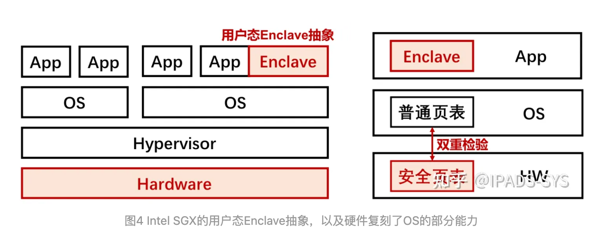
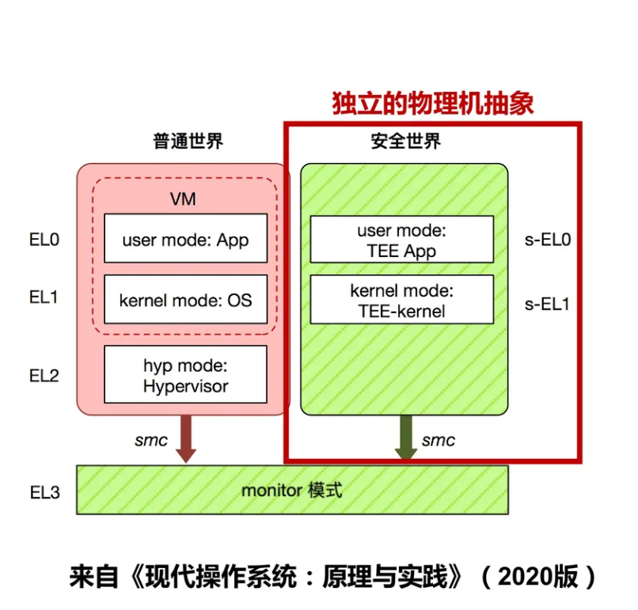
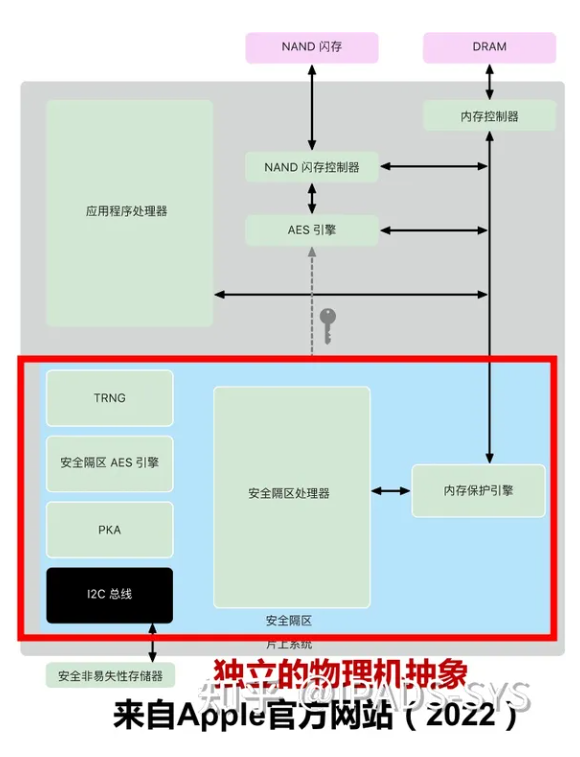

# 思维导图

https://www.processon.com/v/647860e12acefa1f4bbbede1

# 前言

在计算的过程中，数据存在三种状态：传输中、静止时和使用中。通过网络传输的数据处于“传输中”的状态；存储的数据处于“静止”状态；而正在处理的数据处于“使用中”的状态。在这个世界上，我们正不断地存储、使用和共享各种敏感数据：从信用卡数据到病历，从防火墙配置到地理位置数据。为所有状态下的敏感数据提供保护比以往任何时候都更为重要。现在通行的做法是使用密码学技术为数据机密性（防止未经授权的读取操作）和数据完整性（防止或检测出未经授权的篡改操作）提供保护，但这些技术主要被用于保护传输中和静止状态的数据，目前对“使用中”的数据提供安全防护的技术仍旧属于新的前沿领域。

# 隐私计算

数据流通+隐私保护=隐私计算技术

机密计算是其中一种，利用可信硬件实现

# 机密计算

机密计算指的是通过在基于硬件的可信执行环境（Trusted Execution Environment）中执行计算过程的方式，为使用中的数据提供保护的计算模式。

信任根：永久可信的组件。

# Intel放弃SGX

**本质上是过度复杂的安全计算抽象，及其导致的过于激进的威胁模型**。由于Enclave抽象是应用的一部分，而应用与操作系统的接口与交互极其复杂并且经常演进，导致SGX的硬件设计过于复杂并硬件需要承载很多软件的功能。在这个复杂的安全计算抽象下，SGX的威胁模型则是不相信硬件与操作系统，而Enclave需要依赖操作系统提供各种服务，从而造成一个巨大的攻击面，会引起侧信道攻击等一系列安全问题，最终并不能完全实现SGX设计时假设的威胁模型。此外，过度复杂的设计使其难以合入Linux等操作系统的主线，从而难以形成生态（注：关于SGX的补丁自2016年开始提交给Linux社区，但因其复杂的API设计和不够清晰的假设模型引起社区的反对 [16]，历经5年共41次修订才在内核5.11版本中被合并）。最后，由于复杂的设计，SGX的性能开销也非常大，尤其是在加载阶段：一般而言，创建与初始化一页SGX安全内存需要花费约4万个cycles，而对一个SGX中的安全内存页换入换出则需要8千个cycles（注：以上数据均为在Scalable SGX机器上的测试结果）。

基于以上原因，尽管SGX有很多看起来很好的应用场景，如安全多方计算、区块链、数字版权保护等，其在商业上并没有被大规模推广。

## SGX硬件复杂度

SGX在用户态进程中划分出一块安全“飞地”（Enclave），Enclave内的代码和数据对外界完全不可见。程序员需要显式地对代码进行**静态划分**：安全部分（Enclave）与非安全部分（App），并规定好二者交互的接口。SGX在硬件设计中定义了大量功能，用于检验底层不可信特权软件的行为。具体包括：

1. **安全页表的管理**：对OS中所管理安全内存页的权限位、映射范围、所属者进行检验。
2. **安全线程的管理**：包括了SGX线程的创建、加页、初始化、移除和销毁等一系列环节。
3. **安全内存的换页管理**：因为SGX v1中所使用哈希树保护的安全内存范围实在有限（小于256MB），因此必须在硬件层面提供透明的换页能力，用于虚拟化更多安全内存。
4. **安全内存的完整性校验：**SGX v1通过哈希树来验证完整性，但限于片上存储的容量，以及访存时的性能开销，使得SGX很难在保证完整性的同时支撑较大容量的安全内存（SGX v1是256MB）。因此，Intel在Scalable SGX中直接放弃了对安全内存的完整性保护支持。

以上谈到的前3方面能力本属于操作系统OS的职责范畴，因为SGX对OS的不信任，因此必须在硬件上复刻这部分逻辑。为了避免将OS的复杂度引入到硬件设计中，Intel在处理器中专门设计了XuCode微码架构 [5]，用于处理SGX相关的机器指令。

## **SGX软件复杂度**

SGX不仅加剧了硬件设计的复杂度，也显著提升了软件设计的复杂度。SGX程序员必须手工指定好机密数据，并将相关处理代码显式放入Enclave中，对外暴露为ecall（enclave call）的形式。随着接口数量和参数复杂度的增加，很容易出现机密数据保护的不完备，以及接口被滥用或攻击的问题**。**为此出现了2类解决方案：

1. **机密程序的自动划分**：目前学术界出现基于静态分析的自动化代码划分工具，当前只支持C/C++程序 [6] 和Java程序 [7]。自动划分的前提是程序员必须清楚地知道哪些数据属于**隐私，需要手工标注（annotation）。对任意语言的自动划分工具目前尚不存在。**
2. **库操作系统（LibOS**）：将程序不经修改地运行在飞地中，是对开发者和使用者更加友好的做法。学术界和工业界先后孵化出Graphene-SGX [8] 和Occlum [9] 两个SGX LibOS。必须指出的是，由于SGX本身无法完成OS真正能完成的任务（如文件读写、网络I/O、内存管理）等请求，LibOS必须将来自应用的这部分POSIX请求转发给底层OS。鉴于Iago接口攻击 [11] 的存在，LibOS必须实现一层Shim。**然而，POSIX接口数量众多且非常复杂，很难保证LibOS Shim检验的完备性，目前也只能做到部分文件系统接口的形式化验证 。**

# Occlum

Occlum 是一款蚂蚁集团开源的 TEE OS，可以大幅降低 SGX 应用的开发门槛。使用时只需要 Occlum的三条命令：`new`、`build`和`run`。

更复杂的程序也可以用类似上面的流程通过 Occlum 移植进 SGX 中。用户无需理解 SGX 的二分编程模型，无需或只需少量修改应用代码，还可以自由选择编程语言（比如 Java、Python、Go 等）。使用 Occlum，应用开发者可以将宝贵的精力集中在编写应用上，而非为 SGX 做应用移植。

## 用起来像 Docker 的 TEE OS

Occlum 的一个设计理念是 Enclave-as-a-Container。在云原生时代，容器至关重要，容器无处不在。容器最常见的实现方式是基于 Linux 的 cgroup 和 namespace（比如 Docker），但也有基于虚拟化的实现（比如 Kata）。我们观察到，TEE 或者 Enclave 也可以作为一种容器的实现手段。因此，为了传达这种理念，同时给用户提供一种熟悉的体验，我们特意将 Occlum 的用户接口设计成与 Docker 和 OCI 标准接近。除了前面提到的 `new`、`build`和`run` 三个命令，Occlum 还提供 `start`、`exec`、`stop`、`kill` 等命令，其语意与 Docker 同名命令类似。

简单的用户接口隐藏着复杂的实现细节。为了高层次地描述 Occlum 的技术原理，我们分可信的开发环境和不可信的部署环境两个视角来讨论。

在可信的开发环境（上图中的上半部分），用户使用 `occlum build` 命令打包和制作可信镜像，该可信镜像是利用 Merkel Hash Tree 来保证镜像在上传到不可信的部署环境之后，无法被攻击者篡改。可信镜像的内容是 Occlum 启动时所载入的 rootfs，组织结构与通常的 Unix 操作系统类似，具体内容由用户决定。

在不可信的部署环境（上图中的下半部分），用户使用 `occlum run` 命令启动一个新的 Occlum Enclave，该 Enclave 中的 Occlum TEE OS 会从可信镜像中载入并执行相应的应用程序。Occlum 向应用程序提供与 Linux 兼容的系统调用，因此应用程序无需修改（或只需少量修改）即可运行在 Enclave 中。应用程序的内存状态由 Enclave 保护，应用程序的文件 I/O 由 Occlum 做自动的加解密，因此可以同时保护应用在内存和外存中数据的机密性和完整性。

## 更高效、更强大、更安全和更多内容

除了提供类容器的、用户友好的接口以外，Occlum 还有三个主要特色：

- **高效多进程支持**：Occlum 实现了一种轻量级的进程，相比此前最先进的开源 TEE OS（Graphene-SGX），进程启动提速 10-1000 倍，进程间通信的吞吐量提升 3 倍（详见我们的论文，链接见文末）；
- **强大文件系统**：Occlum 支持多种文件系统，比如保护完整性的文件系统、保护机密性的文件系统、内存文件系统、主机文件系统等等，满足应用的各种文件 I/O 需求；
- **内存安全保障**：作为全球首个使用 [Rust 语言](https://www.rust-lang.org/)开发的 TEE OS，Occlum 极大降低了内存安全问题的几率（据统计，Linux 有 50% 的安全漏洞都与内存安全有关），因此更值得信赖；

# TPM fTPM

TPM:Trusted Platform Modules

fTPM:Firmware TPMs Intel, AMD, 和Qualcomm 都有

PCR:Platform Configuration Registers。测量开机代码，重启和开关机时置0。

# Hyperenclave

隐私计算是解决数据流通和数据安全平衡的重要技术。可信执行环境（TEE）作为隐私计算主流技术之一，现有产品通常是基于特定安全硬件构建的安全边界和可信根，普遍存在绑定硬件平台、通用性差、可信根被CPU厂商主导、仅支持单一运行模式，灵活性不足等问题。

支持机密云计算，可以不需要硬件特殊硬件feature就能安全地运行在云中可用的已停产服务器上和ARM（RISC-V）服务器上。

process-based TEE abstraction：虚拟化扩展-（隔离）+TPM（信任根和随机性等）

HyperEnclave提供了一种开放通用的TEE解决方案，支持多种硬件平台，具备灵活的TEE应用运行模式，且兼容已有TEE生态。

阐述了HyperEnclave的设计原理及创新点。HyperEnclave利用广泛支持的虚拟化技术构建安全边界，基于**TPM**构建可信根，可支持当前主流硬件架构，如Hygon、AMD和Intel CPU，避免了绑定特定硬件平台。

　　针对TEE典型应用特点，HyperEnclave提供了**三种Enclave运行模式**

* monitor mode:映射到VMX root模式
* normal mode:不受信任的OS和应用运行在此，映射到VMX non-root模式
* secure mode:受信任的应用（比如enclave）运行在此，能被灵活映射到VMX non-root的ring-3或者ring-0模式，或者VMX root mode的ring-3模式

 可更好地适应计算密集型、I/O密集型、内存密集型和异常处理密集型的应用需要。在开发环节，HyperEnclave兼容主流TEE应用开发生态，已有TEE应用无需或少量修改代码即可迁移到HyperEnclave。

## GU-Enclave

Guest user enclave。

隐私计算技术当前一大挑战是，安全性的提升往往带来性能的下降，二者较难兼顾。在TEE应用负载性能测试中，HyperEnclave 在计算密集型(NBench)，内存密集型(SQLite)，I/O密集型(lighttpd)，混合型(Redis)等不同属性的工作负载下均表现出良好的性能，同等安全等级下，HyperEnclave相比其他TEE产品性能更强。

# 主流TEE

## ARM TrustZone

TrustZone是ARM在2002年提出的隔离机制，和Intel SGX不同，ARM TrustZone的隔离对象包含了CPU、内存、总线结构和外围设备，提供了**独立的物理机抽象**。目前，TrustZone在移动端ARM手机上被广泛部署和使用，用于生物信息识别（指纹识别、人脸识别、虹膜识别）以及安卓系统密钥管理等安全特性。支付宝和微信支付也通过在安全世界中部署的安全应用实现基于指纹识别的快捷支付功能。通常，在ARM TrustZone会运行一个小而精的内核，如Huawei iTrustee、OP-TEE、QSEE、Trustonic、T6等。

## 英飞凌optiga TPM芯片

## 苹果T2芯片

## Intel的SGX

一个enclave包含：可信代码、数据，metadata。metadata不加载进EPC里，不受信任的加载器用它来决定如何将enclave合适地加载进EPC。

## Google云平台的Titan

## AWS的Nitro安全芯片	

